### I'm JUNW.You can also call me Liu Jiajun👋👋.

## 个人技术架构

```mermaid
graph TB
    subgraph 全栈能力["全栈能力 Full-Stack"]
        direction TB
        A[全栈工程师] --> B[Java后端开发]
        A --> C[Vue前端开发]
        A --> D[数据爬虫]
        A --> E[系统集成]
    end
    
    subgraph 后端技术["后端技术 Backend"]
        B --> F[Spring Boot]
        B --> G[Spring Cloud]
        B --> H[MyBatis]
        B --> I[MySQL数据库]
    end
    
    subgraph 前端技术["前端技术 Frontend"]
        C --> J[Vue 2/3]
        C --> K[Element UI]
        C --> L[HTML5/CSS3]
        C --> M[JavaScript]
    end
    
    subgraph 数据处理["数据处理 Data Processing"]
        D --> N[微信爬虫]
        D --> O[微博爬虫]
        D --> P[小红书爬虫]
        D --> Q[抖音爬虫]
        D --> R[反爬虫技术]
    end
    
    subgraph 项目经验["项目经验 Projects"]
        E --> S[电商系统]
        E --> T[账号管理平台]
        E --> U[微信数据工具]
        E --> V[爬虫应用]
    end
    
    style A fill:#4A90E2,stroke:#2E5C8A,color:#fff
    style B fill:#ED8B00,stroke:#CC8F3D,color:#fff
    style C fill:#42B883,stroke:#2E7D4D,color:#fff
    style D fill:#FF6B6B,stroke:#CC5555,color:#fff
    style E fill:#9B59B6,stroke:#7D4692,color:#fff
    style F fill:#FFA64D,stroke:#CC8F3D,color:#fff
    style G fill:#FFB870,stroke:#CC8F3D,color:#fff
    style H fill:#FFCA93,stroke:#CC8F3D,color:#fff
    style I fill:#009639,stroke:#006D2A,color:#fff
    style J fill:#50C878,stroke:#2E7D4D,color:#fff
    style K fill:#60D488,stroke:#2E7D4D,color:#fff
    style L fill:#1572B6,stroke:#0E4A7A,color:#fff
    style M fill:#F7DF1E,stroke:#B7A100,color:#333
    style N fill:#07C160,stroke:#058A40,color:#fff
    style O fill:#E6162D,stroke:#A81120,color:#fff
    style P fill:#FF2442,stroke:#CC1D35,color:#fff
    style Q fill:#000000,stroke:#333333,color:#fff
    style R fill:#8B0000,stroke:#5C0000,color:#fff
    style S fill:#3498DB,stroke:#2471A3,color:#fff
    style T fill:#E74C3C,stroke:#B03A2E,color:#fff
    style U fill:#1DA1F2,stroke:#1480B9,color:#fff
    style V fill:#FF4757,stroke:#CC3945,color:#fff
```

## Thanks for visiting my profile page🌏:

    <a href="README.md">English</a>
    ·
    <a href="./README_cn.md">简体中文</a>

Hi, I am a full-stack engineer from China, you can call me Jiajun Liu or junw.

My undergraduate degree is in molecular biology and my master's degree is in computer science in the United States. I have rich experience in **Java backend development**, **Vue frontend development**, **data crawling**, and **system integration**. My projects cover e-commerce systems, account management platforms, WeChat data processing tools, and various web scraping applications.

Learning projects and code snippets can be accessed from <a href="https://github.com/wo1261931780"> my profile </a>, and open source business projects can be found in <a href="https://github.com/junwOpenSourceProjects"> junw open source projects </a>.

Thank you for your visit! I'm passionate about building scalable systems and exploring new technologies. Feel free to reach out for collaboration!

[//]: # (折线图出现异常)

  

## Couple things about me💫:

- 🧬 Bachelor's degree in molecular biology.

- 🏦 Full-stack engineer specializing in **Java backend** (Spring Boot, Spring Cloud, MyBatis) and **Vue.js frontend** (Vue 2/3, Element UI).

- 🕷️ Experienced in **web scraping** and **data processing** (WeChat, Weibo, Xiaohongshu, Douyin crawlers), skilled in reverse engineering and anti-crawling techniques.

- 💻 You can find me on [linkedin](https://www.linkedin.com/in/%E4%BD%B3%E7%8F%BA-%E5%88%98-3a4345156/), [Twitter](https://twitter.com/home), [Weibo](https://weibo.com/u/6511079715), [Instagram](https://www.instagram.com/junwang7789/).

- 🎓 Graduated from **Jimei University**, Master of Computer Science at **ASU**, welcome all alumni to connect!

- 📋 I am saving up for a house and welcome business contacts from all tech gurus.

- 💪 Jiangxi native, currently settled in Xiamen, waiting for a good **job opportunity** for a long time.

- 💌 I like my girlfriend very much, the opposite sex do not disturb🤣🤣🤣.

- 🚀 The technical level needs to be improved, and I hope to become a full-stack engineer in the future.

- 😂 ~~The rest of the content has not yet been thought of~~.

  
<b>Technology Stack Information 📈</b>

   

## My Skills 🚀

 

 

## Tools I Use 🔧

 

 

## Find me around the web 🌏:

 

    work：
    <a text="work">wo1261931780@gmail.com</a>
    ·
    wechat：
    <a text="work">wo1261931780</a>
    ·
    Personal：
    <a text="work">642344572@qq.com</a>

**Nice to meet you and best wishes for you, my friends :)**

<h2></h2>

 

## Some statistics 💪💪💪:

  
<b>More statistics 📈</b>

   

[//]: # (更多统计卡片)

[//]: # (奖杯展示)

[//]: # (自己账号的被查看次数)

[//]: # (萝莉举牌，自己账号的被查看次数)

